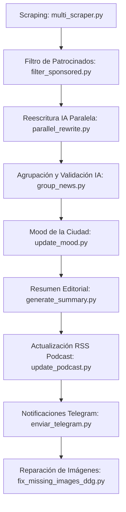

# Gasteiz Live — Portal de Noticias con IA para Vitoria-Gasteiz

**Gasteiz Live** es un portal web de noticias local para Vitoria-Gasteiz y Álava completamente automatizado. El sistema recopila noticias de múltiples fuentes locales, las procesa e integra inteligencia artificial para filtrar anuncios encubiertos, reescribir y agrupar con precisión el contenido, realizar análisis de sentimiento, generar resúmenes diarios, calcular el "estado de ánimo" (Mood) de la ciudad, enviar alertas a Telegram y producir un podcast diario automatizado.

La interfaz web moderna se actualiza y despliega automáticamente en **Vercel** tras cada ejecución.

---

## 🛠️ Arquitectura del Sistema y Pipeline de Procesamiento

El ciclo de actualización se gestiona mediante el script principal [run_pipeline.py](file:///c:/Users/ortas/OneDrive/Documentos/Noticias_Gasteiz/run_pipeline.py) (o sus homólogos ejecutables en Windows) y consta de las siguientes fases ordenadas:



### 1. Recopilación y Deduplicación Inicial
- **Scraper ([multi_scraper.py](file:///c:/Users/ortas/OneDrive/Documentos/Noticias_Gasteiz/scraper/multi_scraper.py))**: Extrae noticias de diversas fuentes locales vitorianas. Evita duplicados idénticos cruzando con el historial de URLs procesadas en `scraper/history.json`. Se conservan noticias de las últimas **72 horas** y un máximo de **200 artículos** en `data/news.json`.

### 2. Filtro de Publirreportajes con IA ([filter_sponsored.py](file:///c:/Users/ortas/OneDrive/Documentos/Noticias_Gasteiz/scraper/filter_sponsored.py))
- Analiza las noticias de Gasteiz Hoy antes de enviarlas al paso de reescritura.
- Utiliza la clave dedicada **`DEDUPLICITY2`** (con fallbacks) y el modelo **Qwen** para detectar posts patrocinados y publirreportajes comerciales camuflados de noticias (servicios privados de ADN, clínicas estéticas, aplicaciones de cuidado de perros, etc.).
- Si se detecta un patrocinio, se elimina inmediatamente del listado de noticias, ahorrando llamadas de reescritura posteriores y tokens de la API. Las noticias legítimas se marcan con un flag de cacheado (`sponsored_checked: true`).

### 3. Reescritura Paralela con IA ([parallel_rewrite.py](file:///c:/Users/ortas/OneDrive/Documentos/Noticias_Gasteiz/scraper/parallel_rewrite.py))
- Procesa múltiples artículos nuevos en paralelo (hasta 6 hilos simultáneos) usando la API de **Groq**.
- Genera titulares más directos y reescribe el contenido en un tono periodístico propio, protegiendo cifras, nombres y fechas clave.
- Mantiene los campos `original_title` y `original_body` como respaldo.

### 4. Agrupación y Validación Semántica con IA ([group_news.py](file:///c:/Users/ortas/OneDrive/Documentos/Noticias_Gasteiz/scraper/group_news.py))
- Pre-agrupa las noticias de diferentes periódicos usando similitud de Jaccard en el backend.
- Para clústeres candidatos de más de un elemento, invoca a **Qwen** para confirmar si tratan del mismo suceso o noticia exacta.
- Divide inteligentemente grupos mixtos erróneos (por ejemplo, separando detenciones ocurridas por delitos y personas distintas en diferentes barrios).
- Añade a los artículos validados un `group_id` único y marca con `grouped_verified: true` para cachear la decisión y evitar llamadas repetidas al LLM en futuros runs del pipeline.

### 5. Análisis de Sentimiento de Doble Capa ([analyze_sentiment.py](file:///c:/Users/ortas/OneDrive/Documentos/Noticias_Gasteiz/scraper/analyze_sentiment.py))
- **Capa Heurística**: Evalúa el texto mediante diccionarios locales de términos positivos y negativos en español. Aplica reglas especiales inmediatas (por ejemplo, clasifica automáticamente como negativas noticias de sucesos violentos, accidentes o conflictos políticos concretos).
- **Capa de IA (Groq/Qwen)**: Si el resultado de la primera capa es neutral o indefinido, consulta un modelo de lenguaje para una evaluación de sentimiento precisa (`positiva`, `negativa`, `neutral`), puntuación cuantitativa y asignación de categoría (Política, Economía, Sociedad, Deportes, Cultura, etc.).

### 6. Resumen Diario Inteligente ([generate_summary.py](file:///c:/Users/ortas/OneDrive/Documentos/Noticias_Gasteiz/scraper/generate_summary.py))
- Genera de forma incremental o desde cero un boletín editorial estructurado con las noticias del día sobre Álava y Deportes.
- Se inserta dinámicamente como la primera tarjeta destacada del portal en la web.

### 7. "Mood" o Estado de Ánimo de Vitoria-Gasteiz ([update_mood.py](file:///c:/Users/ortas/OneDrive/Documentos/Noticias_Gasteiz/scraper/update_mood.py))
- Calcula diariamente un índice medio (entre -1 y +1) basado en el sentimiento ponderado de las noticias de la jornada. El historial se guarda en `data/mood_history.json` para renderizar el gráfico semanal interactivo.

### 8. Notificaciones en Telegram ([enviar_telegram.py](file:///c:/Users/ortas/OneDrive/Documentos/Noticias_Gasteiz/scraper/enviar_telegram.py))
- Envía automáticamente al canal configurado alertas de noticias de Álava y Deportes con título enriquecido, imagen adjunta y enlace directo al portal. Controla envíos previos con `data/sent_news_ids.json`.

### 9. Corrección de Imágenes ([fix_missing_images_ddg.py](file:///c:/Users/ortas/OneDrive/Documentos/Noticias_Gasteiz/scraper/fix_missing_images_ddg.py))
- Busca y asigna de manera autónoma imágenes ilustrativas utilizando la API de búsqueda de DuckDuckGo para aquellas noticias que carezcan de miniatura original.

---

## 🎙️ Pipeline Automatizado de Podcast ([podcast_pipeline.py](file:///c:/Users/ortas/OneDrive/Documentos/Noticias_Gasteiz/podcast_pipeline.py))

Gasteiz Live integra un pipeline que automatiza por completo la creación y publicación de un podcast diario:

1. **Selección**: Filtra las noticias más relevantes de las últimas 24 horas que no hayan sido utilizadas previamente (guardando el registro en `scraper/podcast_history.json`) y compila un archivo de texto plano: `noticias_hoy_notebooklm.txt`.
2. **Generación de Audio**: Levanta una instancia controlada de Chrome con **Playwright** en modo no-headless (preservando perfiles de sesión en `browser_session` para evitar bloqueos de login).
3. **NotebookLM**: Accede al servicio de Google NotebookLM, crea un cuaderno temporal con el archivo `.txt` subido, configura el resumen de audio en duración corta ("Corto") y descarga el archivo `.wav` generado por las voces de IA.
4. **Spotify for Podcasters**: Sube el audio a la plataforma de podcasts de Spotify de manera automatizada, rellena el título y la descripción del día y programa su publicación.
5. **Sincronización Web ([update_podcast.py](file:///c:/Users/ortas/OneDrive/Documentos/Noticias_Gasteiz/scraper/update_podcast.py))**: Escucha el RSS del podcast y actualiza `data/podcast.json` con los identificadores más recientes de los episodios en Español (ES), Euskera (EU) y Polaco (PL) para incrustar los reproductores de audio directamente en la web.

---

## 🖥️ Interfaz Web Frontend (SPA)

La interfaz de usuario principal se compone de archivos estáticos puros optimizados ([index.html](file:///c:/Users/ortas/OneDrive/Documentos/Noticias_Gasteiz/index.html), [app.js](file:///c:/Users/ortas/OneDrive/Documentos/Noticias_Gasteiz/app.js) y [style.css](file:///c:/Users/ortas/OneDrive/Documentos/Noticias_Gasteiz/style.css)):

- **Agrupación Híbrida Inteligente**: Agrupa visualmente artículos basándose en el `group_id` validado por la IA en el backend. Si una noticia fue clasificada como historia individual, se renderiza directamente separada. Utiliza un fallback de Jaccard en local solo para compatibilidad con elementos antiguos sin campo de grupo.
- **Selector de Fuentes**: Si una noticia cuenta con múltiples medios, el feed muestra un badge descriptivo. Al abrir la noticia, se puede alternar el cuerpo del texto entre las fuentes originales (El Correo, Diario de Noticias, Gasteiz Hoy) de forma dinámica.
- **Filtros Dinámicos**: Permite alternar la visualización por sentimiento (Positivo/Neutral/Negativo) y por estado de lectura (Leídas/No leídas). Las leídas se atenúan y mueven al final automáticamente.
- **Secciones Temáticas**: Pestañas de rápido acceso para Deportes, Cultura, Economía y Sociedad.
- **Widget de Mood**: Visualización animada en tiempo real de la temperatura emocional de la ciudad con un gráfico de los últimos 7 días.
- **Reproductor de Podcast**: Incrustación del reproductor oficial de Spotify directamente en el portal web con el último episodio generado.
- **Detalle Dinámico y SEO**: Rutas virtuales amigables con el historial del navegador para facilitar compartir enlaces específicos.

---

## 🚀 Automatización en Windows

Para asegurar que el portal permanezca actualizado sin intervención manual constante, se incluye soporte de ejecución en segundo plano para Windows:

- **[update_news.bat](file:///c:/Users/ortas/OneDrive/Documentos/Noticias_Gasteiz/update_news.bat)**: Script interactivo de 8 pasos que ejecuta el pipeline localmente y sube automáticamente todos los cambios y datos a GitHub para disparar el despliegue en Vercel.
- **[update_news_silent.bat](file:///c:/Users/ortas/OneDrive/Documentos/Noticias_Gasteiz/update_news_silent.bat)**: Versión silenciosa para ejecuciones automatizadas de fondo en el Programador de Tareas.
- **[INSTRUCCIONES_WINDOWS.md](file:///c:/Users/ortas/OneDrive/Documentos/Noticias_Gasteiz/INSTRUCCIONES_WINDOWS.md)**: Guía paso a paso para programar una tarea repetitiva cada 15 minutos en el **Programador de Tareas de Windows** mediante comandos de administrador.

---

## 🔧 Requisitos e Instalación

1. Clona el repositorio e instala las dependencias de Python:
   ```bash
   pip install -r requirements.txt
   ```
2. Si deseas ejecutar la automatización del podcast, asegúrate de instalar Playwright y sus navegadores:
   ```bash
   pip install playwright
   playwright install chrome
   ```
3. Configura el archivo de variables de entorno `.env` en la raíz (usa `env.example` como plantilla) con tus credenciales de la API de Groq (incluyendo las claves `DEDUPLICITY1` y `DEDUPLICITY2`), Telegram Bot Token y Chat ID.
4. Para realizar una actualización manual completa del portal, simplemente corre el script unificado:
   ```bash
   python run_pipeline.py
   ```

---

Made with ❤️ from Katowice for Vitoria-Gasteiz
